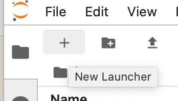

# Getting started on tutorials

:::{admonition} Updates in progress
:class: warning

The resources are actively being updated! Some parts are still out of date, and is the content from last year. In the meantime, please watch out for references to 2020, 2021 ("OHW21") or links that don't work.

:::

## Introduction

Most tutorials will be run live as Jupyter notebooks on the [OceanHackWeek JupyterHub ("The Hub")](https://ocean.hackweek.io/) in your browser. The instructor and and all participants can be running their own copies of the notebooks in their Hub account, with files cloned from the OHW source in GitHub.

Below are instructions for getting the tutorials started on the the Hub in your browser, and updating the tutorials files with the latest version from GitHub. The schedule of tutorials is available [here](../schedule.md), and links to tutorial materials and some background resources are availabe elsewhere in the Tutorials section.


## Pre-Hackweek tutorials

- **Git and GitHub, including the Git fork - clone "workflow".** [Presentation slides (pdf)](https://github.com/oceanhackweek/ohw-preweek/tree/master/git-github-survival-guide") &mdash; [video](https://youtu.be/7nYFRixSV2c)
- **Jupyter and Scientific Python basics: numpy, pandas, matplotlib.** [Jupyter notebooks](https://github.com/oceanhackweek/ohw-preweek/tree/master/data-analysis-modules) &mdash; [video](https://youtu.be/CTUAgpvfze0)


## Start the Hub in your browser

### Step 1
Navigate to the [OceanHackWeek Hub, https://ocean.hackweek.io/](https://ocean.hackweek.io/).

### Step 2
Sign in using your GitHub account, if you are not already signed in. (First time only: Grant the OceanHackWeek Organization permissions - this grants you access to the cloud computing environment for the Hackweek.)

### Step 3
Start the "Oceanhackweek" computing environement (the Oceanhackweek "image"). It may take up to a minute or so to start up.


## Upload (`git clone`) a copy of the `oh20-tutorials` GitHub repository and follow along
This basic workflow allows you to follow along with tutorials with your own live copy of the tutorials notebooks while staying up-to-date with any changes made to the master tutorials repository, [ohw20-tutorials](https://github.com/oceanhackweek/ohw20-tutorials).

### Shortcut
The first time you try to upload (`git clone`) the `ohw20-tutorials` repository, launch a new terminal, then enter:

```bash
git clone https://github.com/oceanhackweek/ohw20-tutorials.git
```

Now you have a new `ohw20-tutorials` directory under your "home" directory, `/home/jovyan`. You're good to go!

### Longer description - Step 1
Navigate to the [tutorial repository on GitHub](https://github.com/oceanhackweek/ohw20-tutorials).

Clone the tutorial to the Hub environment. You can easily copy the link to a repository by selecting the green "clone or download" dropdown (making sure the pop up says "Clone with HTTPS") and hitting the clipboard icon, which will automatically copy the link for you.

Launch a terminal using the "plus" sign in the upper left corner of your JupyterHub:



then execute the `git clone` statement:

```bash
git clone https://github.com/oceanhackweek/ohw20-tutorials.git
```

A new `ohw20-tutorials` directory will be created, holding the repository clone.

<!-- _Note: a more detailed version of step 1, including images, is available as part of the [Preliminary Steps - JupyterHub Connection](https://icesat-2hackweek.github.io/learning-resources/preliminary/jupyterhub/#how-do-i-get-my-code-in-and-out-of-pangeo) -->

### Step 2
Follow along by opening and running the tutorial notebooks. You can save changes within your clone (such as edits to a notebook) or add other files, then download a copy to your local machine if you'd like.

### Step 3
Update your Hub copy with any changes to the `origin` repository. If you have saved changes within your local copy of the notebook or added other files, this may cause conflicts (*ask us questions if you run into problems!*). Fetch and merge (using `git pull`) the latest changes from the `origin` remote.

```bash
git pull origin
```

These instructions assume you're working on the default `master` branch.

**Please note: the OceanHackWeek JupyterHub (the Hub) should not be relied upon to save your files beyond the duration of the hackweek, and will be removed a couple of weeks after the hackweek. Thus, for any non-repository changes or repository changes that have not been pushed to GitHub, you MUST complete Step 3 to save the files to your local machine if you would like continued access to them.**

----
Adapted from [https://icesat-2hackweek.github.io/learning-resources/tutorials/getting_started/](https://icesat-2hackweek.github.io/learning-resources/tutorials/getting_started/). Originally from [https://medium.com/sweetmeat/how-to-keep-a-downstream-git-repository-current-with-upstream-repository-changes-10b76fad6d97](https://medium.com/sweetmeat/how-to-keep-a-downstream-git-repository-current-with-upstream-repository-changes-10b76fad6d97)
